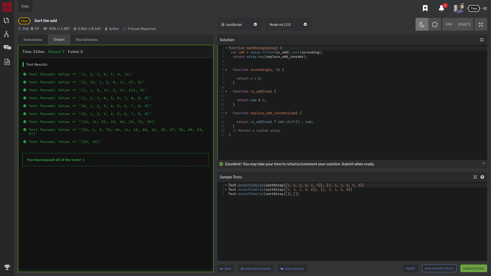

# My Awesome Project
You have an array of numbers.
Your task is to sort ascending odd numbers but even numbers must be on their places.

Zero isn't an odd number and you don't need to move it. If you have an empty array, you need to return it.

Example

sortArray([5, 3, 2, 8, 1, 4]) == [1, 3, 2, 8, 5, 4]
## How It's Made
With this challenge, I knew had to write a callback function and set a variable for this new array I will be making of  sort ascending odd numbers but before I get to that I will have to write the functions

function sortArray(array) {

  var odd = array.filter(is_odd).sort(ascending);
  return array.map(replace_odd_inorder);

}

## Sample Tests:

## Lessons Learned:

How to properly use .sort(), .length, functions, modules, ascending sort method.
## portfolio:

**WEBSITE:** https:johnfleurimond.com

## Happy Coding!!!!
